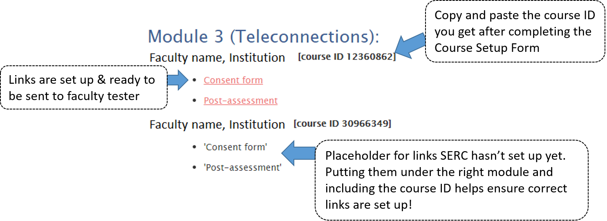
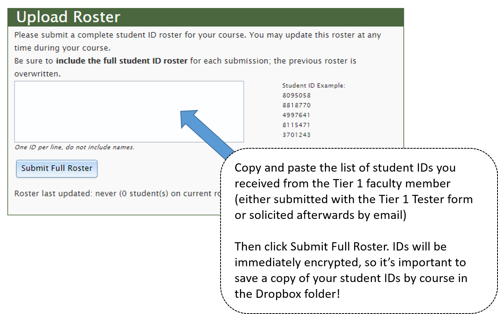

# Tier 1 Tester Generalized Workflow
This document lays out the recommended workflow for setting up Tier 1 testers for Macrosystems EDDIE modules

### Jump to:   
**Tier 1 Tester Generalized Workflow**  
-   Flowchart  

**SERC Pages**  
-   Tier 1 Course Setup Form  
-   Testing & Data Collection

# Important SERC links
### [Tier 1 Course Setup Form](https://serc.carleton.edu/eddie/macrosystems/pilot/course_setup.html)
Use this form to submit new Tier 1 testers to SERC team so they can set up the course-specific consent page and pre/post links.

Fill in full name, institution, and department based on Tier 1 tester; ALWAYS use *your* email address.

Set the initial pre **open** date 2 weeks prior to the module teaching date, and the pre **close** date the day after the module is taught (closes at midnight the morning of date listed, so afternoon classes may have students completing the pre-assessment that day)

***

### [Testing & Data Collection](https://serc.carleton.edu/eddie/macrosystems/pilot/index.html)
Internal page with course-specific consent and post-module assessment links

To facilitate SERC link setup, add new courses to this page with text placeholders for "Consent" and "Post Assessment" links, as shown in the example for Module 3 below. 

***

### [Course Status Page](https://serc.carleton.edu/admin/assess/generic_course.php?cid=26390341)
Use this page to check the status of student pre/post assessment completion, and change dates for pre/post assessment open/close dates.

The link above will take you to one prior Tier 1 course; copy and paste the course ID for the class you want to check the status for (e.g., copy and paste ID 12360862 from example image above) after the "cid=" portion of the URL

On this page, you can do almost everything related to managing existing Tier 1 testers! 

#### Uploading roster of student IDs
To make it easy to send student participation information to Tier 1 testers, upload the student ID roster to the course status page. 

#### Checking who has completed pre/post assessments
Once you have uploaded a roster, you can check which students have completed the pre/post assessments. 

